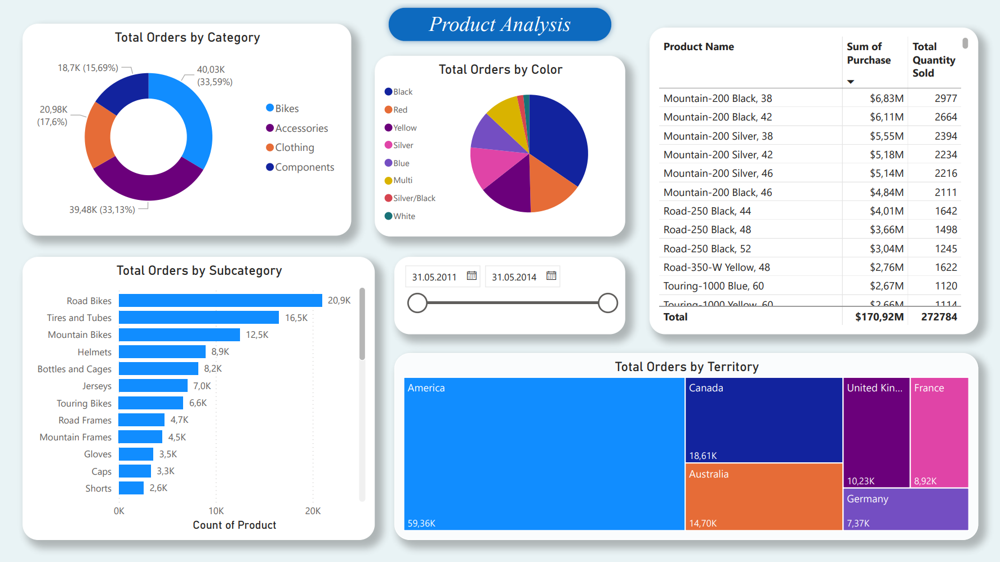
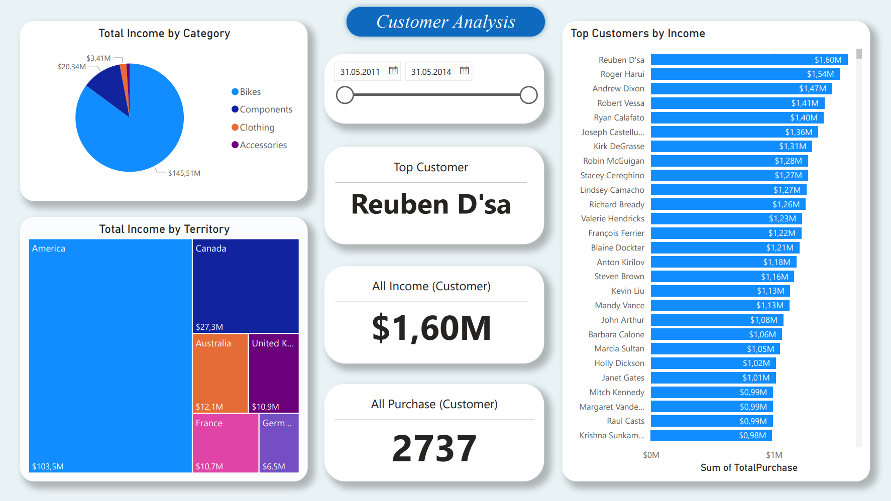
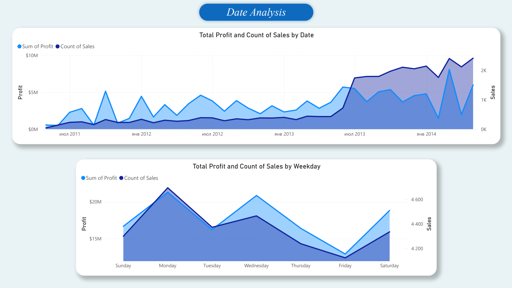

# SQL query
  Men malumotlarni SQL serverga AdventureWorks2022 database ni yuklab shu orqali SQL querylar yaratganman va yangi jadval hosil qilganman va PowerBI orqali serverga ulanib dashboard yaratdim.
# DASHBOARD da nimalar analiz qilingan

 ## MAHSULOTLAR analizi
  Bu qismda mahsulotlarni kategoriyalar va hududlar bo'yicha sotilishi va qaysi mahsulot bizga ko'p daromad olib kelyapti va qaysilari eng ko'p sotilganini ko'rishimiz mumkin.
 ## MIJOZLAR analizi
  Bu yerda esa eng ko'p xarid qiluvchi va eng daromad olib keluvchi mijozlar hududlar kesimida keltirilgan.
 ## VAQT bo'yicha analiz
  Vaqt bo'yicha analiz qismida eng ko'p daromad va savdolar qaysi yilda va qaysi oyga to'g'ri kelayotgani ko'rsatib berilgan

OrderHistory:

OrderDetail:

## PowerBI dashboard

